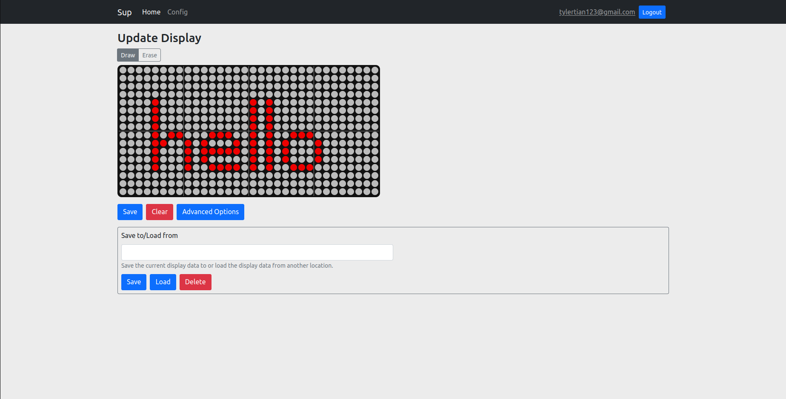
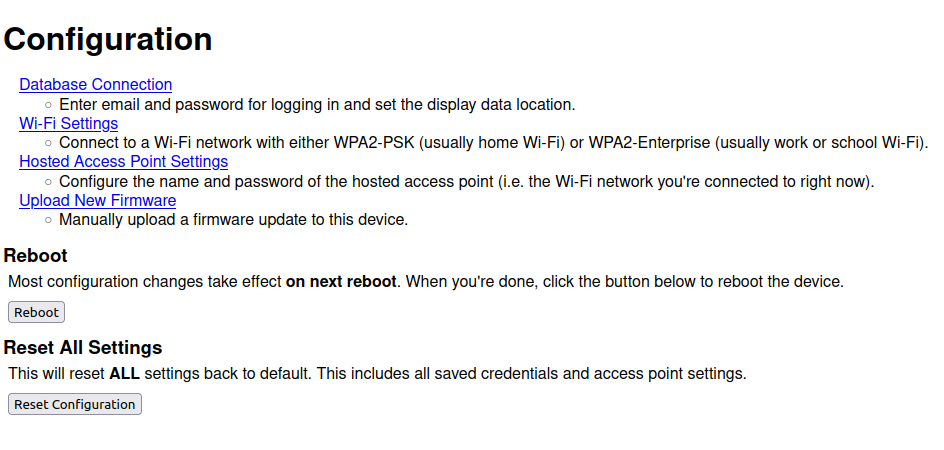
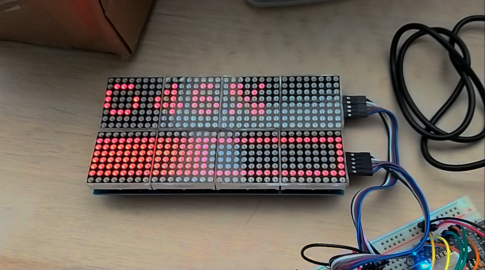
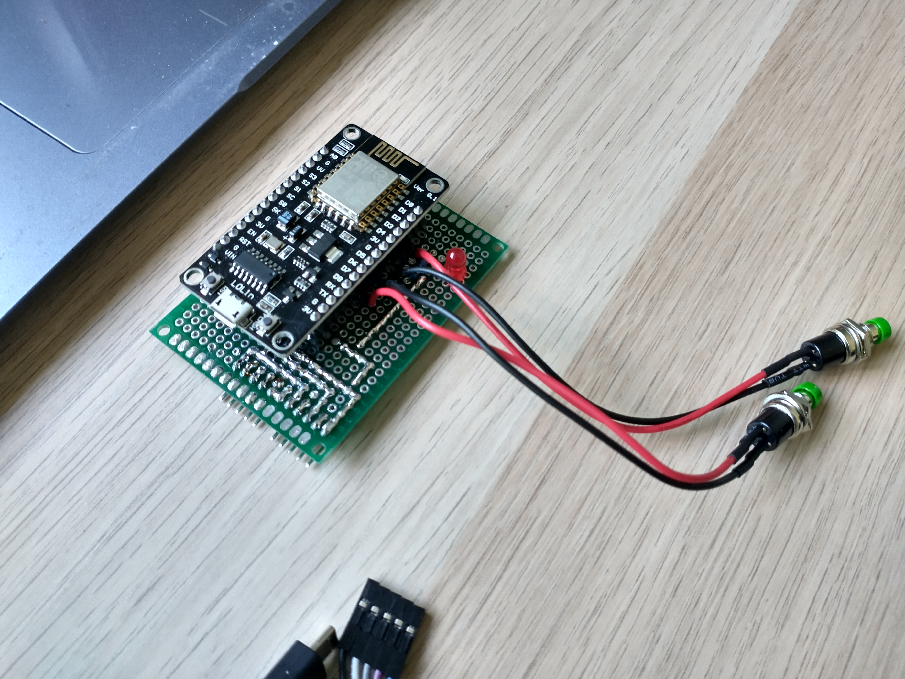

# Sup (Sreela's Unnamed Project)

Sup is a Wifi-enabled smart LED matrix display, controllable through a web app. The contents of the display can be set remotely from anywhere in the world. Give one to your closest friends, and no matter where they are in the world, you can always use the display to send them an encouraging message every day to show you care!

This project is powered by an ESP8266 and Google Firebase. The ESP8266 reads the display contents from Firebase using the [Firebase-ESP8266](https://github.com/mobizt/Firebase-ESP8266) library, while a light React frontend hosted on Firebase sets the contents from anywhere in the world.

Notable features include:
* Easy-to-use web app to set display contents anywhere in the world
* Support for OTA (Over-The-Air) software updates so you can send updates remotely
* Local configuration server to connect to Wifi, update firmware, etc
* Sleep mode to conserve power until next display update

For setup and usage instructions, please refer to the [manual](manual/manual.md).

## Gallery

*Sup prototype displaying the contents as set on the web app*

*A screenshot from the web app showing the main interface*

*A screenshot from the local web-based config page*

*The fully assembled display and driver board, without cover*

*The display showing progress during an OTA update*

*Front of the driver board without the LED matrix attached*

*Back of the driver board without the LED matrix attached*
