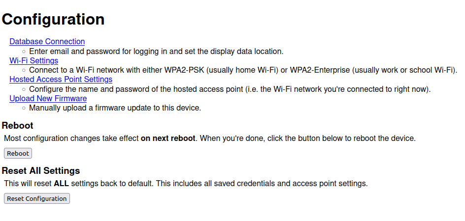
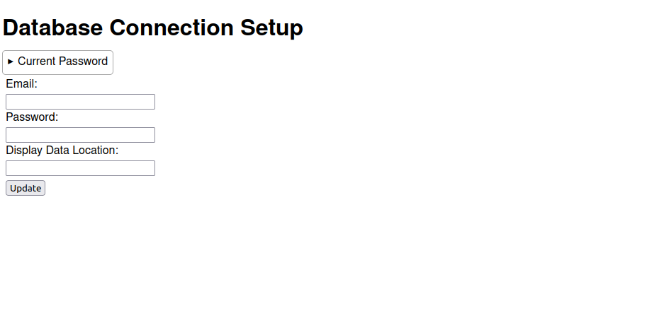
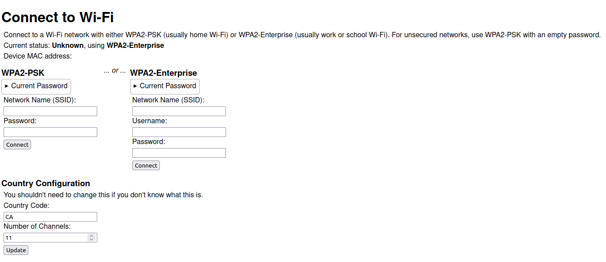
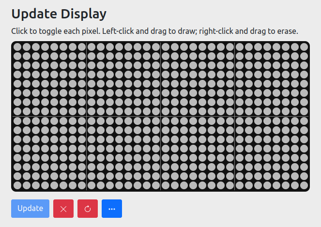
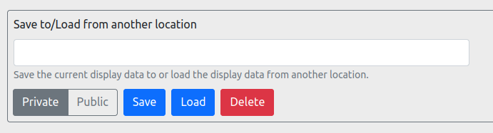

# Sup Usage Manual

- [Initial Setup](#initial-setup)
  - [1. Connecting Your Device](#1-connecting-your-device)
    - [Accessing the Configuration Page](#accessing-the-configuration-page)
    - [Setting up the Database Connection](#setting-up-the-database-connection)
    - [Connect to WiFi](#connect-to-wifi)
    - [Troubleshooting](#troubleshooting)
  - [2. Configuring the Web App](#2-configuring-the-web-app)
- [Web App Usage](#web-app-usage)
  - [Advanced Options](#advanced-options)
- [Device Operation](#device-operation)
- [Configuration Mode](#configuration-mode)
- [Firmware Updates](#firmware-updates)

## Initial Setup

Before you begin, make sure you have an account set up for the web app. There is *no* public sign-up UI, so ask Tyler for an account.

### 1. Connecting Your Device

#### Accessing the Configuration Page

Connect the device to a power source. Since the device doesn't yet know how to connect to WiFi, after the initial boot-up sequence it will enter configuration mode and display "WiFi Error/Use Web Config"

In configuration mode, the device will host its own WiFi network. To access the configuration, use your computer or phone and connect to this network. (Ask Tyler for the default network name/SSID and password.)
Then, go to <http://sup.local> or <http://192.168.0.1> (note the `http` and **not** `https`!) to access the configuration interface:

#### Setting up the Database Connection

First, we will set up the database connection. Click on the Database Connection link:

In the email and password fields, enter the credentials of your account on the web app. The device will use this to log into the database to retrieve the display data. In the display data location field, enter where you want *your* device to read the data from. This could be, for example, your name (without spaces or special characters), but you can choose anything alphanumeric.

The display data location is the location in the database where your device looks for what to display. Your friend can write display data to this location from the web app, which your device will then pick up and display.
The choice is yours, just make sure to tell your friend later!

When you're done, click update and follow the link back to the main configuration interface.

#### Connect to WiFi

Next, we will connect your device to WiFi. Click on the Wi-Fi Settings link:

Use WPA2-PSK if you have a normal home WiFi network with only a name and password. Use WPA2-Enterprise if you have a work or school WiFi network with a username/password login. You only need to use one of them.

Enter the WiFi credentials for either one, then click connect. After 1 second, the device should try to connect to WiFi.

#### Troubleshooting

If the display shows "WiFi Error/Use Web Config" again, then it has failed to connect to WiFi. It will host a network again for you to connect to and reconfigure. Follow the same steps as above and try again (you can skip the database connection).
Double check that you have the correct network name and password, and that the signal is strong enough.

NOTE: Due to hardware limitations, *the device only works on 2.4GHz WiFi networks*. Double check that the network you're trying to connect to is not 5GHz if you're having issues.

If the device connects to WiFi successfully, but shows "DB/Error", then it has failed to connect to the database. This is usually caused by incorrect login credentials.
In this case, you need to *put the device into configuration mode manually*, then follow the instructions above to set up the database connection again.

### 2. Configuring the Web App

Open the web app in a browser (ask Tyler for the URL) and sign in with your credentials (the same ones you entered into the device config). Once signed in, you should see an alert telling you to configure some settings before you can use the app. Follow the link in the alert, or click on Config in the navbar.

In the config page, enter the display data location that your friend entered in *their* device, then click Submit.

(For example, if your friend set their device to read from `foo`, and you set your device to read from `bar` in the previous step, you should set the web app to write to `foo` and your friend should set the web app to write to `bar`. This way, the web app can be used to set the *other* person's display contents. For testing, you can make your web app update your own display by setting it to write to `bar` instead.)

Once the display is updated, you can head back to Home on the navbar, and start using the app!

## Web App Usage

Draw on the display editor in the home page to set the contents of your friend's display. *Note that changes are only saved when you press Update.*

Left or right clicking on any pixel toggles it. Holding down the left mouse button and dragging will turn on the pixels you drag over, while holding down the right mouse button erases them.

The 4 buttons under the editor are, from left to right:

- **Update**: Save the changes you made and update your friend's display contents. The physical display will be updated immediately. (This button is only clickable if you've made changes.)
- **Clear**: Clear the contents of the *editor* (turn off all pixels). Note that this only clears the editor contents and not the actual display. Click Update to clear the real display as well.
- **Reload**: Replace the current editor contents with the saved display contents. This will erase all your changes.
- **Show/Hide Advanced Options**: Toggle the UI for [advanced options](#advanced-options).

### Advanced Options

Advanced options allow you to save or load the editor contents to/from another location in the database. You can use it to save drawings that you like, so they can be loaded back later.

For example, let's say you'd like to update your friend's display to something new, but you still want to keep the current drawing to maybe use later. You can save the current drawing (e.g. enter `myDrawing` in the text box, then click Save), and then update your friend's display like usual. Later, you can load back your initial drawing (e.g. enter `myDrawing` in the text box, then click Load). Note you still need to click Update after loading.

If the selector is set to Private (default), the saved drawing can only be accessed by yourself. If the selector is set to Public, then anyone who has the location of the drawing can load or modify it. You can use this to share a drawing with your friend.

## Device Operation

The device has 2 buttons: :heavy_plus_sign: and :heavy_minus_sign:. Here's what you can do with them:

| Action                                 | Result                                          | Notes                                                                                                                                                                         |
| -------------------------------------- | ----------------------------------------------- | ----------------------------------------------------------------------------------------------------------------------------------------------------------------------------- |
| Press :heavy_plus_sign:                | Display brightness +1                           | Display brightness has 16 levels and is saved even after power is unplugged. Trying to increase the brightness when it's already at level 16 has no effect.                   |
| Press :heavy_minus_sign:               | Display brightness -1                           | See above. Doing this at brightness level 0 has no effect.                                                                                                                    |
| Hold :heavy_minus_sign: (1s)           | Enter sleep mode                                | The display turns off in sleep mode. Press any button to exit sleep mode. On display data update, the device will also exit sleep mode automatically.                         |
| Hold :heavy_plus_sign: (2s)            | Device reboot                                   | The device will reboot *after you release the button*.                                                                                                                        |
| Hold :heavy_minus_sign: during startup | Enter [configuration mode](#configuration-mode) | Hold the button as you plug in the device (or as you're performing a device reboot using the method above), and release it when the display says "Config Mode/Use Web Config" |

## Configuration Mode

## Firmware Updates
